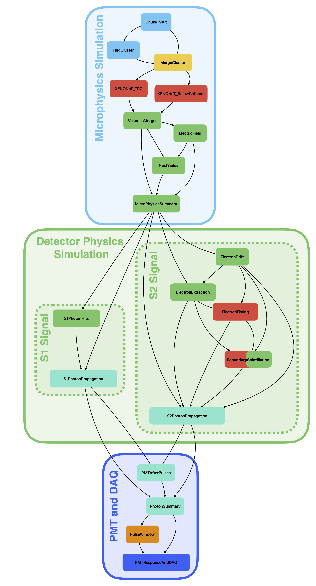

# XENON fuse

[](https://pypi.python.org/pypi/xenon-fuse/)
[](https://coveralls.io/github/XENONnT/fuse)
[](https://github.com/XENONnT/fuse/actions/workflows/pytest.yml)
[](https://xenon-fuse.readthedocs.io/en/latest/?badge=latest)
[](https://results.pre-commit.ci/latest/github/XENONnT/fuse/main)
[](https://zenodo.org/doi/10.5281/zenodo.11059395)

**F**ramework for **U**nified **S**imulation of **E**vents

fuse is the refactored version of the XENONnT simulation chain. The goal of this project is to unify [epix](https://github.com/XENONnT/epix) and [WFSim](https://github.com/XENONnT/WFSim) into a single program. fuse is based on the [strax framework](https://github.com/AxFoundation/strax), so that the simulation steps are encoded in plugins with defined inputs and outputs. This allows for a flexible and modular simulation chain.

## Installation

With all requirements fulfilled (e.g., on top of the [XENONnT montecarlo_environment](https://github.com/XENONnT/montecarlo_environment)):
```
python -m pip install xenon-fuse
```
or install from source:
```
git clone git@github.com:XENONnT/fuse
cd fuse
python -m pip install . --user
```

## Plugin Structure

The full simulation chain in split into multiple plugins. An overview of the simulation structure can be found below.


